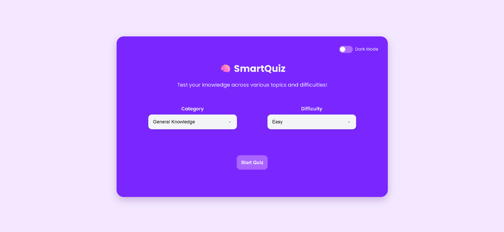
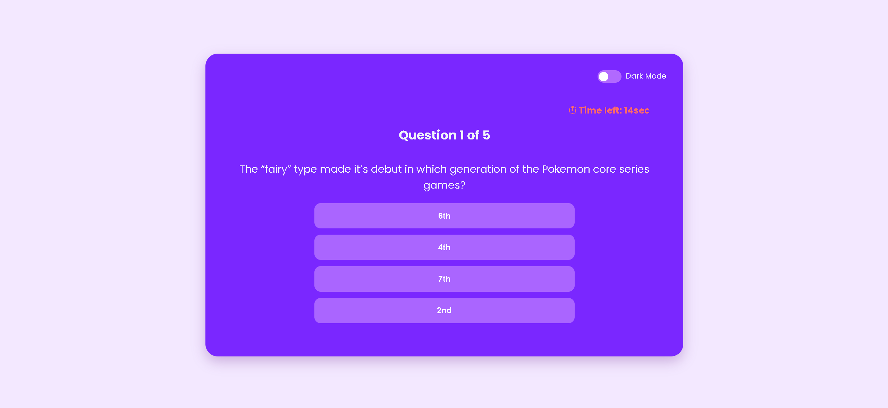

# 🧠 Quizer - Ultimate Quiz App

A sleek and customizable quiz web application with difficulty levels, category selection, offline support, and score tracking. Built using HTML, CSS, and JavaScript.

---

## 🌐 Live Demo

👉 [View Live on Vercel](https://quiz-app-mauve-mu.vercel.app/)

---

## 📸 Screenshots

<!-- Add screenshots here if available -->
  
  

---

## 🚀 Features

- 🎯 Multiple difficulty levels (Easy, Medium, Hard)
- 🧩 Category selection via dropdown
- ⏱ Timed questions with countdown
- 📦 Offline access with Service Worker
- 💾 Score saving & local history
- 🌓 Dark mode toggle
- 📱 Responsive design (Mobile-friendly)

---

## 🛠️ Tech Stack

- HTML5
- CSS3
- JavaScript (Vanilla)
- Service Workers
- Vercel for deployment

---

## 🧪 How to Run Locally

1. Clone the repo:
   ```bash
   git clone https://github.com/Yashsarode933/quiz-app
   cd quiz-app
